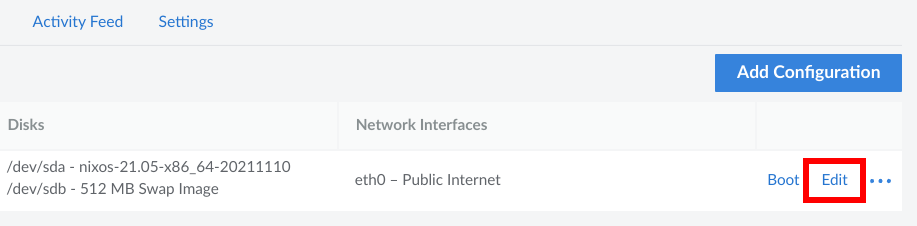
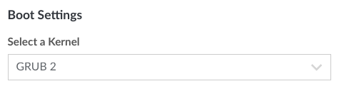
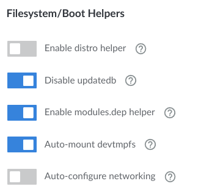
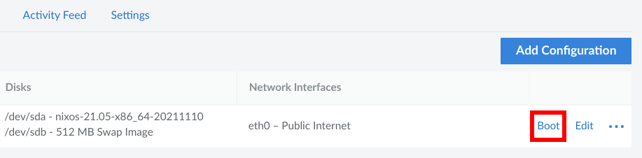

# NixOS image for Linode

The repository contains the [Packer](https://www.packer.io) template to locally build NixOS image for [Linode](https://www.linode.com/) and optionally upload via preconfigured [linode-cli](https://www.linode.com/products/cli/).

> :warning: WARNING: **NixOS is not officially supported on Linode**. There are few guides on how to install NixOS on Linode and this tooling mainly follows the updated steps documented by [Tom Doggett](https://gist.github.com/nocoolnametom) on https://gist.github.com/nocoolnametom/a359624afce4278f16e2760fe65468cc. Use at your own risk!

## Build

Requirements:

- [packer](https://www.packer.io)
- QEMU/KVM
- optionally: [linode-cli](https://www.linode.com/products/cli/)

To build NixOS image for Linode, type:

```
packer build .
```

If the build succeeds, you'll find the gzipped image (with filename extension `.gz`) in `build/` directory. Manually upload the gzipped image (`.gz`) image to the Linode via the web browser. Go to **Linode Manager** → **Images** → **Create Image** → tab **[Upload Image](https://cloud.linode.com/images/create/upload)**.

### Automatically Upload Image

If you have [linode-cli](https://www.linode.com/products/cli/) installed and configured, the Packer can optionally trigger image upload automatically.

Firstly, check the `linode-cli` works, e.g.:

```
$ linode-cli linodes list
┌────┬───────┬────────┬──────┬───────┬────────┬──────┐
│ id │ label │ region │ type │ image │ status │ ipv4 │
└────┴───────┴────────┴──────┴───────┴────────┴──────┘
```

To build and automatically upload the image to Linode, type:

```
$ packer build -var linode_upload=true .
```

## Run Linode VM

To successfully run a VM from the uploaded image, you'll need to do a few simple customizations in the configuration profile of each(!) of your new NixOS Linode VM.

1. **Create a Linode VM** from uploaded image.

2. **Update configuration**

- go to your Linode VM details
- tab **Configurations**
- click on **Edit** on the current configuration



And do following changes:

- in **Boot Settings**
  - set **Select a Kernel** to **GRUB 2**



- in **Filesystem/Boot Helpers** change following features
  - uncheck **Enable distro helper**
  - uncheck **Auto-configure networking**



- **Save** the configuration

3. **Reboot** into a new configuration

Click on **Boot** to reflect the changes.


